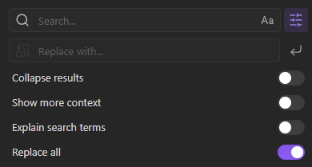

# Obsidian Replace All

Replace All is an Obsidian plugin that injects replace all functionality directly into the core file plugin.

## Usage

1. Use the built-in Obsidian find to find instances to replace.
2. Press the "Replace all" button in the input box.
3. Enter the replacement string.
4. Press Enter.

**Undo replace all**: Use the command palette (Ctrl+P or Cmd+P) and search for "Undo replace all" to undo all changes applied by the previous replacement.

## Installing

1. **Install the Plugin**:
   - (Recommended) If installing through Obsidian, go to Settings > Community plugins > Browse and search for "Replace All".
   - If downloading manually, place the plugin files in your Obsidian plugins folder.
2. **Enable the Plugin**: Go to Settings > Community plugins, find "Replace All" and toggle it on.

## Development

If you want to contribute or modify the plugin, follow these steps:

- Clone this repo.
- Make sure your NodeJS is at least v16 (`node --version`).
- `npm i` or `yarn` to install dependencies.
- `npm run dev` to start compilation in watch mode.
- Feel free to file a pull request with any improvements.
